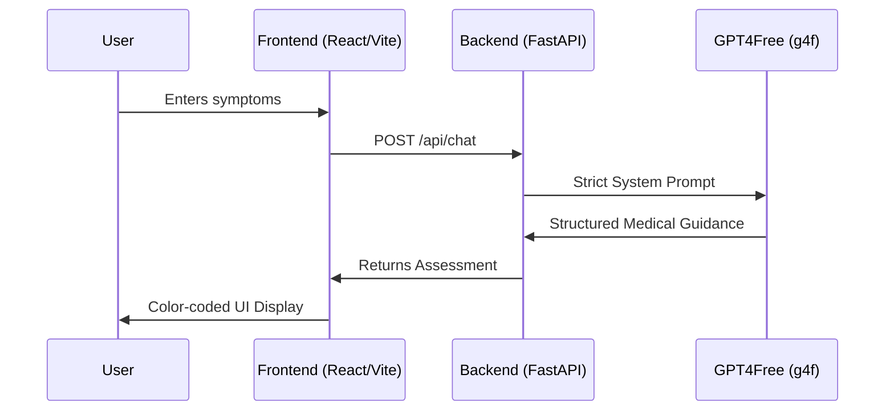

<div align="center">
  
  <br/>
  <h1>🩺 MediGuide AI</h1>
  <p><strong>Your Intelligent, Zero-Cost Symptom Assessment Assistant</strong></p>
</div>

---

## 🌟 What is MediGuide AI?

Ever typed your symptoms into a search engine only to be told you have three days to live? **MediGuide AI** is here to fix that. 

Built as a capstone project for the **Lenovo LEAP NextGen AI Program**, MediGuide AI is a cutting-edge, web-based intelligent symptom assessment tool. It allows users to type in their physical ailments in plain, natural language and uses advanced Generative AI to provide a calm, structured, and logical health assessment.

Instead of plunging into the wild west of internet self-diagnosis, MediGuide AI acts as your rational first step—helping you understand if you just need a glass of water, or if you need to call a doctor *right now*.

---

## ✨ Key Features

- 🧠 **Conversational AI Analysis:** Don't worry about medical jargon. Type how you feel, and the AI understands the context.
- 🚦 **Dynamic Risk Assessment:** Instantly classifies your symptoms into **Low (Green)**, **Medium (Yellow)**, or **High (Red)** risk categories.
- 🔍 **Clear Reasoning:** Explains *why* you received a specific risk level so you aren't left guessing.
- 💡 **Actionable Health Tips:** Provides immediate, practical advice (like hydration or rest protocols) while you decide on your next steps.
- 🏥 **Safety First:** Hardcoded medical disclaimers and emergency protocols ensure the AI acts as a guide, not a doctor.
- 💸 **100% Free Architecture:** Powered by `g4f` (GPT4Free), completely bypassing expensive API keys and annoying ISP blocks.

---

## 🚀 How It Works Under the Hood



---

## 🛠️ Technology Stack

| Component | Technology Used |
| :--- | :--- |
| **Frontend** | React.js, Vite, Tailwind CSS, Lucide Icons |
| **Backend** | Python, FastAPI, Uvicorn |
| **AI Integration** | `g4f` (GPT4Free) for dynamic LLM routing |
| **Version Control**| Git & GitHub |

---

## 💻 Getting Started (Local Development)

Want to run MediGuide AI on your own machine? It's incredibly simple.

**1. Start the Backend:**
```bash
cd backend
pip install -r requirements.txt
python -m uvicorn main:app --reload
```

**2. Start the Frontend:**
```bash
cd frontend
npm install
npm run dev
```
Navigate to `http://localhost:5173` in your browser, and you are good to go!

---

## ⚖️ Medical Disclaimer
*MediGuide AI is designed strictly for educational purposes and preliminary guidance. It is **not** a substitute for professional medical advice, diagnosis, or treatment. If you are experiencing severe symptoms, significant bleeding, difficulty breathing, or loss of consciousness, please seek immediate emergency medical attention.*

---
<div align="center">
  <i>Developed with ❤️ by <b>Dhiraj Shirse</b> for the Lenovo LEAP Program.</i>
</div>
